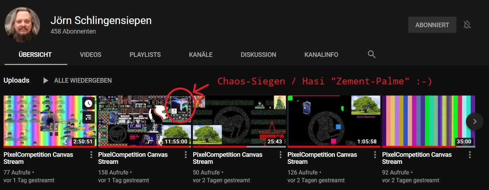
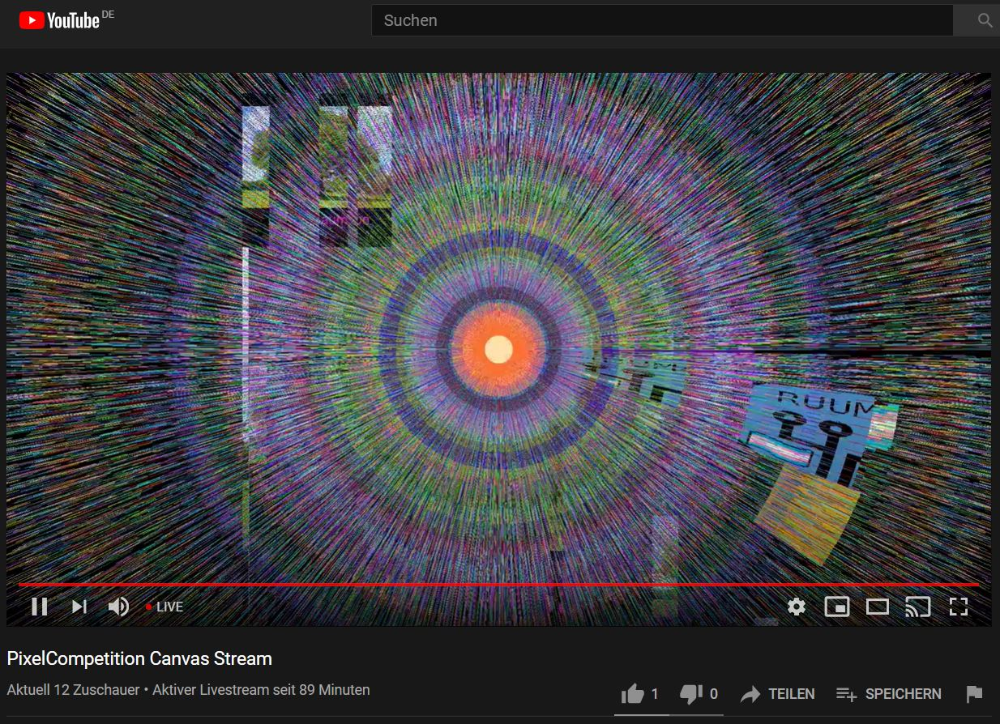
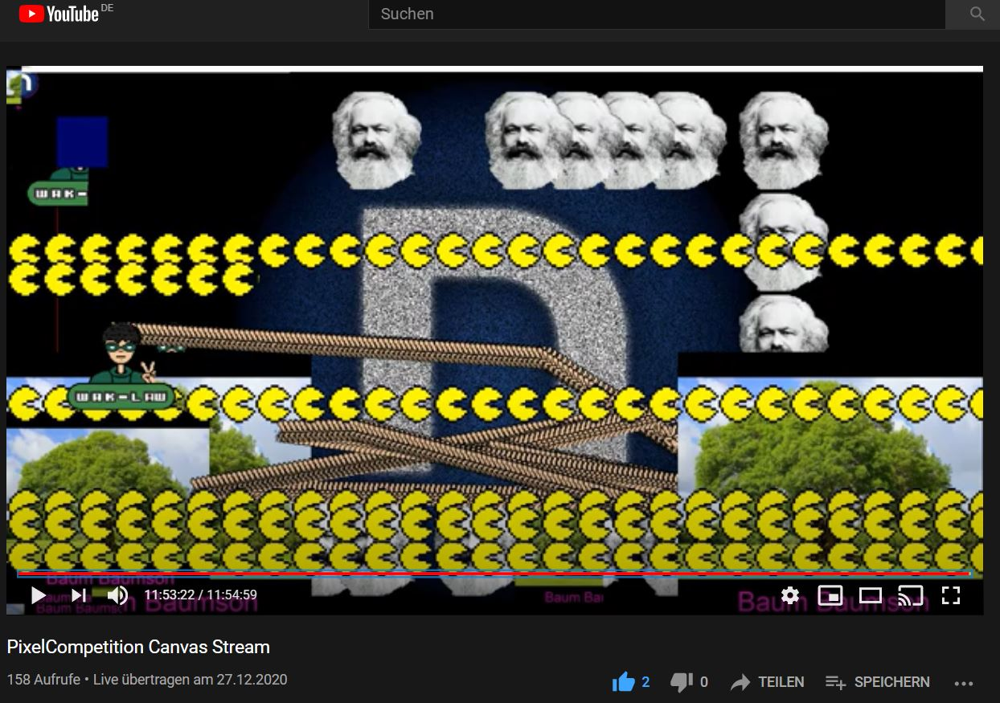

# rC3_PixelCompetition
I had some great fun with the PixelCompetition on the rC3. Everyone could send some TCP packets with coordinates and colors that will end up in a video stream. 

A competition on the canvas: You need to be faster in sending the packets than the others or find an unused corner on the canvas for yourself. I ended up using my Raspberry to set the "Chaos-/Hasi-Siegen-Palme" in the upper right corner. 

Here are some of the python scripts I used and also some screenshots.

# Links
* Stream: https://www.youtube.com/user/jschlingensiepen/live
* Wiki: https://wiki.maglab.space/wiki/PixelCompetition
* Homepage: https://pixel-competition.de/
* Servers: https://cccgoe.de/wiki/Pixelflut // https://github.com/defnull/pixelflut 

